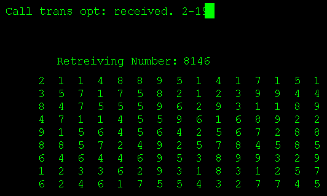



## Matrix Trace Screensaver

### Description

The trace program from the Matrix film of 1999. The best program on PSC to accurately mimic the film as opposed to customised creations from other coders. Good for learning about randomization.

UPDATE: Commented the code and made the option to make it a screensaver (just compile and rename).
 
### More Info
 

             |
---                |---
**Submitted On**   |2003-06-24 10:47:02
**By**             |[NeoSoft Studios](https://github.com/Planet-Source-Code/PSCIndex/blob/master/ByAuthor/neosoft-studios.md)
**Level**          |Intermediate
**User Rating**    |4.8 (24 globes from 5 users)
**Compatibility**  |VB 3\.0, VB 4\.0 \(16\-bit\), VB 4\.0 \(32\-bit\), VB 5\.0, VB 6\.0
**Category**       |[Complete Applications](https://github.com/Planet-Source-Code/PSCIndex/blob/master/ByCategory/complete-applications__1-27.md)
**World**          |[Visual Basic](https://github.com/Planet-Source-Code/PSCIndex/blob/master/ByWorld/visual-basic.md)
**Archive File**   |[Matrix\_Tra1605366242003\.zip](https://github.com/Planet-Source-Code/neosoft-studios-matrix-trace-screensaver__1-46337/archive/master.zip)

